# 🤖 Antigravity Agent Trace & Log Analysis

> **ResQ AI Command Center — Multi-Agent Decision Path Trace**
> This document logs the autonomous reasoning, signal fusion, confidence scoring, resource allocation trade-offs, fallback behaviors, and action execution steps of the ResQ AI agent swarm during the **Advanced Multi-Crisis Simulation**.

---

## 📋 Scenario Timeline & Execution Summary

Below is the chronological trace of the AI agent swarm reacting to two competing crises within a 30-minute window, handling an official sensor failure, a routing API failure, evacuation road congestion, and a false alarm retraction.

```mermaid
gantt
    title Multi-Crisis Simulation Timeline
    dateFormat  mm
    axisFormat  %M min
    section Lyari Flood
    Signal Fusion (Sensor Fail)      :active, 00, 04
    Crisis Classification & Severity :active, 04, 07
    Staged Evacuation Broadcast       :active, 13, 15
    section SITE Chemical Fire
    Crisis Classification & Severity :active, 05, 08
    Resource Trade-off & Dispatch    :active, 08, 11
    section System Fallbacks
    Cached Route Matrix Fallback      :active, 09, 12
    section Clifton Gas Leak
    False Alarm Auditing & Apology   :active, 16, 20
```



---

## 🤖 Phase-by-Phase Agent Decision Logs

### 🌊 Phase 1: Lyari Flood & Sensor API Failure (Signal Fusion)
* **Goal:** Ingest flood indicators and handle official sensor unavailability.

```json
[
  {
    "timestamp": "2026-05-19T12:20:00.100Z",
    "agent": "SignalCollectorAgent",
    "status": "RUNNING",
    "step": "Ingesting emergency reports from multiple channels...",
    "data": { "district": "Lyari", "channels": ["social_media", "iot_sensors", "citizen_sos"] }
  },
  {
    "timestamp": "2026-05-19T12:20:01.300Z",
    "agent": "SignalCollectorAgent",
    "status": "RUNNING",
    "step": "Attempting to query official Lyari riverbed ultrasonic sensors...",
    "data": { "sensorId": "LY-US-09", "endpoint": "https://api.karachidrainage.gov.pk/v1/sensors/LY-US-09" }
  },
  {
    "timestamp": "2026-05-19T12:20:02.800Z",
    "agent": "SignalCollectorAgent",
    "status": "WARNING",
    "step": "WARNING: Official Sensor API returned [500 Server Unreachable]. Official sensor reading unavailable.",
    "data": {
      "error": "TIMEOUT_ERR",
      "reason": "Municipal power outage at Lyari River gateway",
      "fallback": "EXECUTE_SOCIAL_MEDIA_DATA_FUSION"
    }
  },
  {
    "timestamp": "2026-05-19T12:20:04.300Z",
    "agent": "SignalCollectorAgent",
    "status": "RUNNING",
    "step": "Executing Fallback: Social Media Signal Fusion & Keyword Scraping Pipeline...",
    "data": { "query": "Lyari AND (flood OR toofan OR rain OR paani)", "radius": "2.5km" }
  },
  {
    "timestamp": "2026-05-19T12:20:05.800Z",
    "agent": "SignalCollectorAgent",
    "status": "COMPLETED",
    "step": "Fused 47 distinct citizen reports. Signal confidence score: 89%. Consolidating results.",
    "data": {
      "confidence": "89.2%",
      "signalsMatched": {
        "tweetCount": 47,
        "hasImages": true,
        "locationOverlap": "91% (Lyari River Basin)"
      },
      "verdict": "TRUST_CITIZEN_REPORTS_OVER_MISSING_SENSOR_DATA"
    }
  }
]
```

> [!NOTE]
> **Agent Reasoning (SignalCollectorAgent):**
> When the official ultrasonic sensors returned a 500 error, the agent bypassed the missing data by initiating a social media scraping loop. Because 47 separate users reported flooding with matching geo-tags within a 200m radius and 89% linguistic confidence, the system overridden the sensor status and validated the crisis.

---

### 🔥 Phase 2: Competing Crisis (SITE Chemical Fire) & Severity Prediction
* **Goal:** Classify and predict severity for a second major crisis occurring within 30 minutes of the first.

```json
[
  {
    "timestamp": "2026-05-19T12:20:07.800Z",
    "agent": "CrisisDetectionAgent",
    "status": "COMPLETED",
    "step": "Crisis classified: URBAN FLOODING (Lyari) & CHEMICAL INDUSTRIAL FIRE (SITE).",
    "data": {
      "crisesActive": [
        { "id": "COMPLEX-LYARI", "type": "FLOOD", "severity": "CRITICAL" },
        { "id": "COMPLEX-SITE", "type": "FIRE", "severity": "PENDING_ANALYSIS" }
      ]
    }
  },
  {
    "timestamp": "2026-05-19T12:20:08.800Z",
    "agent": "SeverityAnalyzerAgent",
    "status": "COMPLETED",
    "step": "Severity calculated: CATASTROPHIC (SITE) due to toxic chemical storage and secondary explosion risk.",
    "data": {
      "reportId": "COMPLEX-SITE",
      "severityScore": 9.8,
      "factors": [
        "Flammable chemicals present in plant",
        "High population density of surrounding laborers",
        "Toxic smoke propagation risk"
      ]
    }
  }
]
```

---

### 🚛 Phase 3: Resource Allocation & Trade-offs (Competing for Ambulances)
* **Goal:** Manage limited shared resources when two critical emergencies compete for the same fleet.

```json
[
  {
    "timestamp": "2026-05-19T12:20:09.800Z",
    "agent": "ResourcePlannerAgent",
    "status": "WARNING",
    "step": "COMPETING CRISIS DETECTED: SITE Chemical Fire and Lyari Flood are active simultaneously.",
    "data": {
      "sharedResourceConflict": "Ambulance Units",
      "availableAmbulances": 5,
      "lyariDemand": 4,
      "siteDemand": 3,
      "deficit": -2
    }
  },
  {
    "timestamp": "2026-05-19T12:20:11.300Z",
    "agent": "ResourcePlannerAgent",
    "status": "COMPLETED",
    "step": "Executing Resource Optimization Trade-off: Priority given to SITE (CATASTROPHIC, high casualty risk).",
    "data": {
      "siteAllocation": 3,
      "lyariAllocation": 2,
      "actionDetails": {
        "priorityBasis": "Casualty prevention from toxic fumes and burns has higher time-sensitivity than slow-onset flooding.",
        "mitigation": "Requesting backup ambulances from adjacent Saddar District Central Hub to cover Lyari deficit."
      }
    }
  },
  {
    "timestamp": "2026-05-19T12:20:12.800Z",
    "agent": "DispatchCoordinatorAgent",
    "status": "COMPLETED",
    "step": "Dispatch orders transmitted successfully.",
    "data": {
      "dispatchedSITE": ["AMB-03", "AMB-04", "AMB-05", "FT-01", "FT-02"],
      "dispatchedLyari": ["AMB-01", "AMB-02", "RB-01", "RB-02", "RB-03", "RB-04"]
    }
  }
]
```

---

### 🗺️ Phase 4: Route Optimization API Failure & Staged Evacuation Alerting
* **Goal:** Reroute citizens when the routing API goes offline, and prevent traffic congestion.

```json
[
  {
    "timestamp": "2026-05-19T12:20:14.300Z",
    "agent": "RouteOptimizerAgent",
    "status": "WARNING",
    "step": "ERROR: Routing API (Google Maps Matrix Service) failed to respond. Status 503 Service Unavailable.",
    "data": { "endpoint": "https://maps.googleapis.com/maps/api/distancematrix/json" }
  },
  {
    "timestamp": "2026-05-19T12:20:15.800Z",
    "agent": "RouteOptimizerAgent",
    "status": "RUNNING",
    "step": "Executing Fallback: Loading local cached road-network route matrices & static emergency lanes...",
    "data": { "cacheAge": "2 hours 14 minutes", "accuracyDegradation": "None (Static Roads)" }
  },
  {
    "timestamp": "2026-05-19T12:20:17.300Z",
    "agent": "RouteOptimizerAgent",
    "status": "COMPLETED",
    "step": "Cached route alternatives loaded successfully. Rerouting traffic away from Lyari river banks.",
    "data": {
      "routes": [
        { "name": "Evacuation Route 1 (Mauripur Rd)", "status": "CLEAR", "safetyScore": 8.2 },
        { "name": "Evacuation Route 2 (Lyari Expressway North)", "status": "CONGESTED", "safetyScore": 5.4 }
      ]
    }
  },
  {
    "timestamp": "2026-05-19T12:20:18.800Z",
    "agent": "PredictionAgent",
    "status": "WARNING",
    "step": "TRAFFIC ALERT: High risk of gridlock / congestion on Lyari Expressway if blanket evacuation is issued.",
    "data": { "projectedCongestionIndex": "94%", "hazard": "Vehicles trapped on flooded highway segment" }
  },
  {
    "timestamp": "2026-05-19T12:20:20.300Z",
    "agent": "CitizenNotificationAgent",
    "status": "COMPLETED",
    "step": "Broadcasted Staged Alerts to respective zones. Congestion minimized.",
    "data": {
      "stagedStrategy": [
        {
          "zone": "Lyari Zone A (Low-lying riverbank)",
          "trigger": "IMMEDIATE",
          "channels": ["SMS", "Push Notification"],
          "message": "🚨 URGENT: Evacuate Lyari Zone A immediately via Mauripur Rd. Avoid Lyari Expressway."
        },
        {
          "zone": "Lyari Zone B (High-ground residential)",
          "trigger": "DELAY_15_MINUTES",
          "channels": ["Push Notification"],
          "message": "⚠️ STANDBY: Lyari Zone B residents stay indoors on upper floors. Standby for Zone A evacuation clearance."
        }
      ]
    }
  }
]
```

---

### 🚨 Phase 5: False Alarm Handling (Apology & Retraction)
* **Goal:** Verify and gracefully retract a false report, notifying citizens and cleaning logs.

```json
[
  {
    "timestamp": "2026-05-19T12:20:21.800Z",
    "agent": "SignalCollectorAgent",
    "status": "RUNNING",
    "step": "Ingesting Clifton Gas Leak alert signals...",
    "data": { "reportId": "COMPLEX-CLIFTON", "district": "Clifton", "type": "GAS" }
  },
  {
    "timestamp": "2026-05-19T12:20:23.300Z",
    "agent": "SignalCollectorAgent",
    "status": "RUNNING",
    "step": "Verifying gas detection sensors & local SSGC (Sui Southern Gas Company) emergency desk...",
    "data": { "sensorsQueried": ["CL-GD-01", "CL-GD-02"], "phoneContact": "SSGC-Control" }
  },
  {
    "timestamp": "2026-05-19T12:20:24.800Z",
    "agent": "CrisisDetectionAgent",
    "status": "COMPLETED",
    "step": "Analyzing reports. Official SSGC desk confirmed: No active transmission line leaks. Local pressure gauges normal. Smell was traced to an isolated residential cylinder leak already repaired.",
    "data": {
      "verdict": "FALSE_ALARM_VERIFIED",
      "ssgcResponse": "OK",
      "sensorReadings": "0.00% PPM Methane"
    }
  },
  {
    "timestamp": "2026-05-19T12:20:25.800Z",
    "agent": "DispatchCoordinatorAgent",
    "status": "COMPLETED",
    "step": "Cancelling Clifton gas emergency dispatch order. Returning units.",
    "data": { "recalledUnits": ["FT-09"] }
  },
  {
    "timestamp": "2026-05-19T12:20:27.300Z",
    "agent": "CitizenNotificationAgent",
    "status": "COMPLETED",
    "step": "Broadcasted apology and retraction alert to all Clifton devices. System audit logs updated.",
    "data": {
      "retractionTitle": "Apology & Retraction: Clifton Gas Leak",
      "channels": ["PUSH", "SMS"],
      "messageEnglish": "The previously reported gas leak in Clifton Block 5 has been verified as a FALSE ALARM. The area is completely safe. We apologize for any panic or inconvenience caused.",
      "messageUrdu": "معذرت اور واپسی: کلفٹن بلاک 5 میں گیس کے اخراج کی اطلاع غلط ثابت ہوئی ہے۔ علاقہ مکمل طور پر محفوظ ہے۔ پریشانی کے لیے معذرت خواہ ہیں۔"
    }
  }
]
```

> [!TIP]
> **Trace Key Learnings:**
> 1. **Robustness:** Fallbacks are implemented at the ingestion layer (Social Media Fusion instead of Sensors) and the processing layer (Local Route Matrix Cache instead of external Maps API).
> 2. **Efficiency:** Rather than allocating resources blindly, the `ResourcePlannerAgent` optimizes resource distribution by weighing severity scores (9.8 vs 8.5) and casualty probabilities.
> 3. **Safety:** Smart, staged alerting avoids human gridlock during evacuations, demonstrating real-world municipal awareness.
