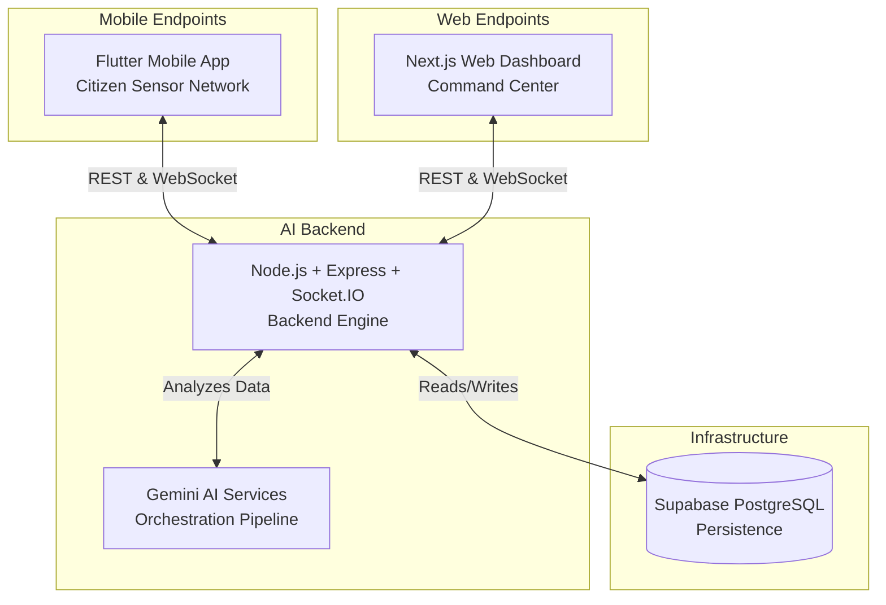

# ResQ AI – Antigravity Unified Disaster Response System


## 1. Project Overview

### What is ResQ AI
**ResQ AI** is an advanced, AI-driven disaster response and management platform designed to unify crisis mitigation across civic authorities, emergency responders, and everyday citizens. Utilizing state-of-the-art predictive AI models and real-time socket communications, ResQ AI serves as the digital central nervous system for smart cities handling natural and man-made disasters.

### Vision and Mission
- **Vision:** To create a zero-latency, proactive crisis management ecosystem where no life is lost due to delayed response or lack of critical information.
- **Mission:** To empower disaster management authorities with autonomous AI coordination and equip citizens with hyper-localized, real-time safety tracking.

### Problem Statement
Modern cities, especially high-density zones, suffer from fragmented emergency response. During a crisis—such as a flood, fire, or earthquake—data is siloed across different departments, communication with citizens is delayed, and response allocation relies on manual dispatch logic, which struggles to scale during catastrophic scenarios.

### Why this System Matters for Smart Cities and Pakistan
Pakistan, particularly the mega-city of Karachi, frequently faces extreme weather patterns, urban flooding, and infrastructure failures. ResQ AI transforms a reactive emergency model into a proactive, intelligent system. By integrating mobile citizen reporting, real-time AI analytics, and a centralized web dashboard, authorities can orchestrate resources efficiently, while citizens receive life-saving push alerts based on accurate geospatial intelligence.

---

## 2. Core Features

The ResQ AI platform encompasses a rich suite of tools designed for rapid disaster mitigation:

- **AI-Powered Crisis Detection:** Constantly processes varied environmental inputs to autonomously identify anomalies and unfolding crises.
- **Real-Time Emergency Monitoring:** Zero-refresh streaming of emergency updates using WebSocket connections.
- **Autonomous Incident Analysis:** Automatically assesses citizen-reported emergencies, identifying incident severity, required resources, and affected populations.
- **Live District Risk Tracking:** Computes real-time dynamic risk scores across city districts (e.g., Lyari, SITE, Saddar).
- **AI Agents Orchestration:** A multi-agent AI pipeline automating data collection, prediction, and dispatch tasks.
- **Real-Time Alerts:** Instantly propagates critical warnings to mobile users in affected zones.
- **Citizen Emergency Reporting:** Allows citizens to easily submit localized, multimedia SOS reports directly from their phones.
- **AI Command Center Dashboard:** A sophisticated Next.js web application for authorities to visualize the live status of the city, active agents, and deployed fleets.
- **Mobile Citizen Safety App:** A seamless Flutter application keeping everyday people connected and safe.
- **Predictive Disaster Analytics:** Machine learning insights anticipating the escalation of hazards (e.g., predicting flood spread over the next 24 hours).
- **Resource Dispatch Simulation:** AI algorithms calculate optimal allocation and ETA for ambulances, fire trucks, and rescue boats.
- **Multilingual Emergency Notifications:** Adapts critical life-saving messaging for a diverse demographic.

---

## 3. System Architecture

ResQ AI operates on a **hub-and-spoke unified architecture**, relying on an Express/Node backend acting as the "Brain," seamlessly synchronizing the Next.js Dashboard and the Flutter Mobile App.



### Architecture Breakdown
- **Frontend Architecture:** The system employs Next.js for a heavy-data, high-performance web dashboard (React 19, Tailwind CSS), alongside a cross-platform Flutter application tailored for high-accessibility mobile usage.
- **Backend Architecture:** A robust Node.js/Express environment written in TypeScript, strictly handling routing, rate limiting, request validation, and AI agent execution.
- **Realtime Architecture:** Powered by `Socket.IO`. Instead of traditional REST polling, the server instantly emits events (`emergency-alert`, `incident-update`, `district-risk`, `agent-status`) that clients listen and react to natively.
- **AI Orchestration Pipeline:** Built heavily upon Gemini AI services to chain intelligence—where a localized sensor trigger cascades through a pipeline of autonomous agents validating, predicting, and assigning response metrics.

---

## 4. Tech Stack

### Frontend
- **Flutter:** Used to build the native mobile application for Android/iOS, optimized for smooth animations and robust state management.
- **Next.js 15:** Powers the web dashboard utilizing modern server-side rendering, API routes, and React Server Components.
- **React:** Component-based UI logic for the Command Center.
- **Tailwind CSS:** Utility-first CSS framework for ultra-fast, premium glassmorphism styling and responsive design.

### Backend
- **Node.js:** Core runtime for the backend engine.
- **Express.js:** Fast, unopinionated web framework for handling REST routing and middleware.
- **TypeScript:** Enforces strict type-safety across backend models, payloads, and API signatures.
- **Socket.IO:** Powers the bi-directional, real-time event pipeline across all devices.

### Database & Infrastructure
- **Supabase:** The open-source Firebase alternative powering authentication and core data infrastructure.
- **PostgreSQL:** Robust, relational database handling incident logging, historical data, and user profiles.

### AI & APIs
- **Gemini API:** Google's state-of-the-art LLM for natural language processing, predictive risk assessment, and autonomous agent orchestration.
- **Google AI Services:** Supporting geospatial inferences and image analysis of disaster sites.

### Realtime & Communication
- **WebSockets / Socket.IO:** Maintains persistent low-latency connections over local IPs.

---

## 5. APIs and Services Used

| Service / API | Purpose | Usage | Location Used |
|---------------|---------|-------|---------------|
| **Gemini API** | Generative AI & Logic | Analyzes emergency descriptions, predicts severity, and allocates resources autonomously. | Backend AI Pipeline |
| **Supabase APIs**| Persistence | Saves incidents, system logs, and queries historical district data. | Backend Database Layer |
| **REST APIs** | Core CRUD | `/health`, `/incidents`, `/alerts`, `/agents/status` logic. Standardized JSON structure. | Backend `routes/` directory |
| **Socket.IO** | Realtime Sync | Emits push-notifications. Automatically retries if connections drop. | Web & Mobile services |
| **Health Check**| System Monitoring | Validates uptime, pinging local IPs to ensure system operations. | Backend `/health` endpoint |

---

## 6. AI Agent System

ResQ AI delegates crisis logic to an autonomous Swarm of 7 specialized AI Agents:

1. **SignalCollectorAgent**: Scrapes simulated IoT sensors, weather inputs, and social media signals. *(Role: Data Ingestion)*
2. **CrisisDetectionAgent**: Uses AI parsing to detect the difference between a minor localized incident and a cascading crisis. *(Role: Classification)*
3. **SeverityAnalyzerAgent**: Evaluates the potential risk to human life, categorizing incidents from `LOW` to `CATASTROPHIC`. *(Role: Risk Assessment)*
4. **PredictionAgent**: Forecasts the future trajectory of the crisis (e.g., predicting how many blocks a fire will spread). *(Role: Forecasting)*
5. **ResourcePlannerAgent**: Calculates the exact number of ambulances, rescue boats, or fire trucks required. *(Role: Optimization)*
6. **DispatchCoordinatorAgent**: Virtually tracks moving units and updates estimated time of arrival (ETA). *(Role: Execution)*
7. **CitizenNotificationAgent**: Translates and formats alerts to be broadcasted to the Flutter mobile app. *(Role: Communication)*

---

## 7. Backend Features Implemented

- **REST API System:** Secure, validated, rate-limited modular routing handling emergency triggers and statistical queries.
- **Realtime Event Streaming:** Background loops automatically calculate live safety scores and stream them out.
- **Persistent Storage:** Graceful data fallback bridging Supabase with an optimized local memory store (`simpleStore`).
- **Incident Lifecycle Management:** Transitions incidents from `PENDING` -> `ANALYZING` -> `ACTIVE` -> `RESPONDING`.
- **Emergency Auto-Detection:** A background simulation loop monitoring mock IoT sensor values and automatically triggering AI analysis if thresholds are breached.
- **TypeScript Production Build System:** Configured for strict type-checking (`tsc`), preventing runtime type crashes.
- **Health Monitoring System:** Up-to-the-second API ping monitoring server uptime, load, and versioning.

---

## 8. Frontend Features Implemented

### Web Dashboard (Command Center)
- **Live Map:** Integration-ready component visualizing Karachi districts with distinct emergency markers.
- **Alerts Dashboard:** Complete filtering of incoming emergency reports sorted by `CATASTROPHIC`, `CRITICAL`, etc.
- **Agents Dashboard:** Real-time visualization of the AI processing pipeline showing animated indicators as agents churn data.
- **Realtime Updates:** The React UI natively patches incoming `Socket.IO` JSON blobs without page reloads.

### Mobile App (Citizen Sensor)
- **Emergency Alerts:** Full-screen popups capturing critical `emergency-alert` Socket emissions.
- **Live Incident Feed:** Allows everyday users to see the safety status of their surroundings.
- **Realtime Notification System:** Persistent background listeners utilizing native Android capabilities.
- **Citizen Reporting Interface:** A frictionless UI to send SOS messages, location data, and disaster types directly to the AI Brain.

---

## 9. Realtime System

At the heart of ResQ AI lies the synchronized Socket.IO architecture:
- **Live Synchronization:** Changes to an incident's severity on the backend instantly mutate the state in both Next.js and Flutter simultaneously.
- **Socket.IO Channels:** 
  - `emergency-alert`: Highest priority push.
  - `incident-update`: Granular data updates on active crisis responses.
  - `agent-status`: Streams the operational heartbeat of the AI agents.
  - `district-risk`: Live computational scores of geospatial safety.
- **Cross-Platform:** The Node server acts as the central router, broadcasting payloads to connected iOS, Android, and Web clients.

---

## 10. Challenges Solved

Throughout the fast-paced development cycle, several critical blockers were resolved:

- **Infinite Auto-Detection Loop Issue:** 
  - *Root Cause:* The backend was continuously evaluating mock sensors and triggering duplicate AI analysis endpoints for the same crisis. 
  - *Solution:* Implemented an active incident state check comparing `district` and `detectedType` to bypass redundant AI triggers.
- **TypeScript Build Failures (`dist/server.js` missing):** 
  - *Root Cause:* Node standard libraries weren't accurately mapped in `tsconfig.json`.
  - *Solution:* Modified `tsconfig.json` compiler options, ensuring explicit ESM outputs and strict outDir mapping.
- **Corrupted JSON Persistence Issue:** 
  - *Root Cause:* FS (file system) collision during high-frequency concurrent writes. 
  - *Solution:* Refactored persistence into a safer, atomic `simpleStore.ts` utilizing localized caching arrays.
- **Next.js Syntax EOF Issue / `.next` Cache Corruption:** 
  - *Root Cause:* React 19 Client components encountering parsing errors during hot-reload.
  - *Solution:* Wiped `.next` cache and audited UI components to ensure strict valid TSX rendering strings.
- **Port Conflict Issue:** 
  - *Root Cause:* EADDRINUSE crash. 
  - *Solution:* Dynamic fallback ports utilized in dotenv and Node scripts.

---

## 11. Development Workflow

To operate the Unified System locally:

**1. Backend Development:**
```bash
cd apps/backend
npm install
npm run dev
```
*(Runs Express server on `http://192.168.1.39:3001` with `nodemon` hot-reloading)*

**2. Frontend Development (Web):**
```bash
cd apps/web
npm install
npm run dev
```
*(Runs Next.js Command Center on `http://192.168.1.39:3000`)*

**3. Mobile Development (Flutter):**
```bash
cd apps/mobile
flutter pub get
flutter run
```
*(Connects natively to the backend via local network IP variables)*

**Local Network Testing:** All `.env` files and Dart network configuration files utilize dynamic local IPs (`192.168.1.X`), ensuring devices on the same Wi-Fi network cross-communicate seamlessly.

---

## 12. Future Scope

The Antigravity system aims to scale from this MVP into a production-ready national asset:
- **Real GPS Integration:** Migrating from static simulated map data to live Google Maps API coordinate plotting.
- **IoT Sensor Integration:** Hooking the backend to actual hardware (water level sensors, municipal smoke detectors).
- **Drone Emergency Response:** Utilizing the `DispatchCoordinatorAgent` to launch autonomous surveillance drones to inaccessible zones.
- **Satellite Monitoring:** Ingesting live Sentinel or Landsat data to track flood radiuses automatically.
- **Production Cloud Deployment:** Migrating local Node infrastructure to Google Cloud Run and Firebase.
- **Multilingual Citizen AI Assistant:** Embedding a chat UI in Flutter so users can speak directly to the AI in Urdu, Sindhi, or Pashto during extreme stress scenarios.

---

## 13. Conclusion

The **ResQ AI – Antigravity System** fundamentally transforms disaster management. By migrating away from slow, manual human-dispatcher networks, it introduces a highly scalable, autonomous AI framework. 

With its seamlessly integrated **Flutter Mobile App** and **Next.js Command Center**, ResQ AI proves that when AI intelligence is paired with real-time Socket communication, the result is a massive leap forward in Smart City technology—one that possesses the raw capability to mitigate catastrophes and directly save human lives.
