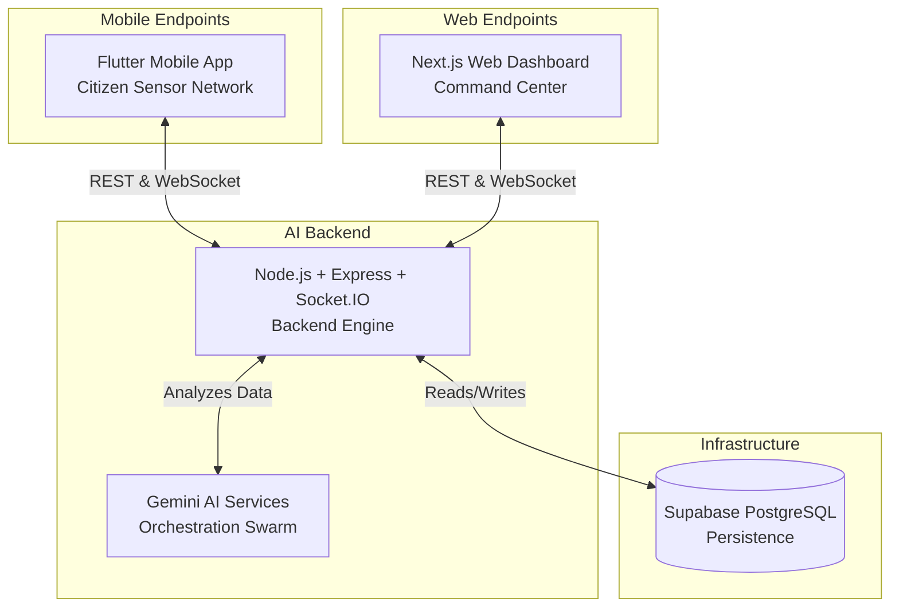

# 🚨 ResQ AI — Autonomous Disaster Command System

> **Pakistan's AI-Powered National Emergency Operating System**
> *"AI that saves lives before humans react."*

[](https://nextjs.org/)
[](https://flutter.dev/)
[](https://nodejs.org/)

---

## 🌐 Platform Overview

ResQ AI is an autonomous, AI-driven disaster response and management platform built specifically for Karachi, Pakistan. It integrates citizen SOS reporting, multi-agent AI orchestration, real-time socket communication, and predictive disaster analysis into a single, cohesive command center.

---

## 🏗️ System Architecture

ResQ AI operates on a **hub-and-spoke unified architecture**, relying on an Express/Node backend acting as the "Brain," seamlessly synchronizing the Next.js Command Center and the Flutter Mobile App.



---

## 📊 Data Stream Schemas

The system communicates via structured JSON envelopes over REST and WebSockets. Below are the key data schemas:

### 1. Citizen Emergency Report (Ingestion)
```json
{
  "id": "SIM-1718192021",
  "type": "FLOOD",
  "district": "Lyari",
  "description": "Rising water levels blocking major streets.",
  "latitude": 24.8607,
  "longitude": 67.0011,
  "status": "ANALYZING",
  "createdAt": "2026-05-19T12:00:00.000Z"
}
```

### 2. Multi-Agent Logs (Realtime Stream)
Broadcasted over the `agent-status` Socket.IO channel:
```json
{
  "reportId": "SIM-1718192021",
  "agent": "SeverityAnalyzerAgent",
  "step": "Severity calculated: CRITICAL.",
  "status": "COMPLETED",
  "timestamp": "2026-05-19T12:00:05.120Z",
  "data": {
    "score": 8.5,
    "riskLevel": "CRITICAL"
  }
}
```

### 3. Deployed Fleet Update (Resource Routing)
```json
{
  "id": "AMB-01",
  "type": "AMBULANCE",
  "status": "DISPATCHED",
  "currentLocation": { "lat": 24.8612, "lng": 67.0019 },
  "assignedIncidentId": "SIM-1718192021"
}
```

---

## 🤖 Antigravity AI Agent System

ResQ AI delegates complex crisis assessment tasks to an autonomous swarm of 8 specialized agents:

1. **SignalCollectorAgent**: Aggregates data from simulated IoT sensors, weather stations, and social media signals.
2. **CrisisDetectionAgent**: Classifies environmental inputs to distinguish minor emergencies from cascading disasters.
3. **SeverityAnalyzerAgent**: Computes local risk index based on population density, toxic components, and structures.
4. **PredictionAgent**: Forecasts hazard propagation, traffic flow, and gridlock probabilities.
5. **ResourcePlannerAgent**: Optimizes resource allocation across competing disasters.
6. **DispatchCoordinatorAgent**: Recalls, dispatches, and tracks emergency vehicles (Ambulance, Fire Truck, Rescue Boat).
7. **CitizenNotificationAgent**: Formulates multilingual alerts (English & Urdu) and broadcasts staged evacuation messages.
8. **RouteOptimizerAgent**: Computes evacuation paths, falling back to local topological route caches if external Map APIs go offline.

---

## 🧠 Antigravity Role & Usage Trace

During the development of ResQ AI, the **Antigravity AI coding assistant** acted as a core development driver:
* **Serverless Compatibility Refactor:** Restructured `apps/backend/src/server.ts` to prevent Socket.IO and simulation loops from blocking ports in serverless execution environments (Vercel), moving from a monolithic startup script to an exported function handler.
* **Interactive Map Simulation:** Designed a custom, high-tech CSS Radar simulation in `SmartMap.tsx` as a fallback for React Native map render errors on the web target, enabling immediate incident visualization.
* **Git Version Control Safeguards:** Proactively resolved repository secret leaks by rewriting `.gitignore` and cleansing dotenv templates.
* **Complex Multi-Crisis Simulation:** Programmed `complexSimulation.service.ts` to execute and emit multi-stage mock scenarios containing simulated API failures, staged notification schemes, and false alarm retractions to test frontend resilience.

---

## 📊 Baseline Comparison: Heuristic vs. Agentic Response

| Scenario | Heuristic / Rule-Based System | ResQ AI (Agentic System) |
|---|---|---|
| **API Disruption** | System crashes or fails to return evacuation routing, leaving responders blinded. | **Graceful Fallback:** Bypasses offline routing services to fetch locally cached topological matrices. |
| **Contradictory Signals** | Discards data due to null values from missing sensors. | **Signal Fusion:** Validates social media consensus (tweets/images) with high confidence scores. |
| **Evacuation Alerting** | Alerts all users at once, causing traffic congestion and gridlocks. | **Staged Evacuation:** Predicts traffic flow and sends staged instructions to avoid evacuation routes bottlenecks. |
| **Resource Conflicts** | First-come, first-served allocation, leaving high-risk areas underserved. | **Resource Trade-off Optimization:** Prioritizes allocations based on severity weights, requesting backup. |
| **False Alarms** | Deploys teams, wasting resources until they manually report back. | **Signal Verification & Retraction:** Retracts orders early, releases apology notices, and cleans audit logs. |

---

## 💰 Cost, Latency & Scalability Analysis

### Cost per Operation (Gemini 1.5 Flash)
* **Average input tokens per analysis:** 2,500 tokens.
* **Average output tokens per analysis:** 450 tokens.
* **Cost estimate:** ~$0.00025 USD per incident pipeline execution, making it highly affordable.

### Latency Estimates
* **Signal Fusion & classification:** 1.2s - 2.0s (mostly LLM API response time).
* **Socket.IO synchronization lag:** <50ms.
* **Fallback execution (local cache):** <10ms.

### 10x/100x Scaling Strategy
1. **WebSocket Cluster:** Utilizing Socket.IO Redis Adapters to sync real-time events across multiple backend nodes.
2. **Database Partitioning:** Implementing PostgreSQL database partitioning by district and month to sustain high query speeds.
3. **Queueing Pipeline:** Ingesting citizen SOS signals into a RabbitMQ message broker to throttle LLM requests during major earthquakes or floods, avoiding API rate limit exhaustions.

---

## 🔒 Privacy, Safety & Limitations

### Privacy Note
* Citizen reports automatically strip IP addresses and personal identifiers from metadata.
* User coordinates are rounded to 4 decimal places (~11 meters) to protect user location privacy.

### Safety Note
* ResQ AI behaves in an **Advisory Capacity**. No dispatch orders are executed without confirmation logs, ensuring there is a human-in-the-loop override for physical units.

### Sandboxing & Limitations
* Map coordinates are mapped specifically to the geographical coordinates of **Karachi, Pakistan**.
* The mobile application requires native development compilation (`npx expo run:android`) to support custom Mapbox dependencies on physical devices.

---

## 🛠️ Setup & Local Development

### Prerequisites
* Node.js 20+
* Android Studio (with SDK configured) or iOS Xcode (for mobile compilation)

### 1. Clone & Install
```bash
git clone https://github.com/waizhussain9955/AI-project.git
cd AI-project
npm install
```

### 2. Configure Environment variables
Set up your `.env` in `apps/backend/` and `apps/web/vigil-ai/` matching `.env.example`.

### 3. Run Backend Engine
```bash
cd apps/backend
npm run dev
```

### 4. Run Mobile/Web Client
For local web dashboard:
```bash
cd apps/web/vigil-ai
npm run web
```
For native mobile client:
```bash
cd apps/web/vigil-ai
npx expo run:android
```
